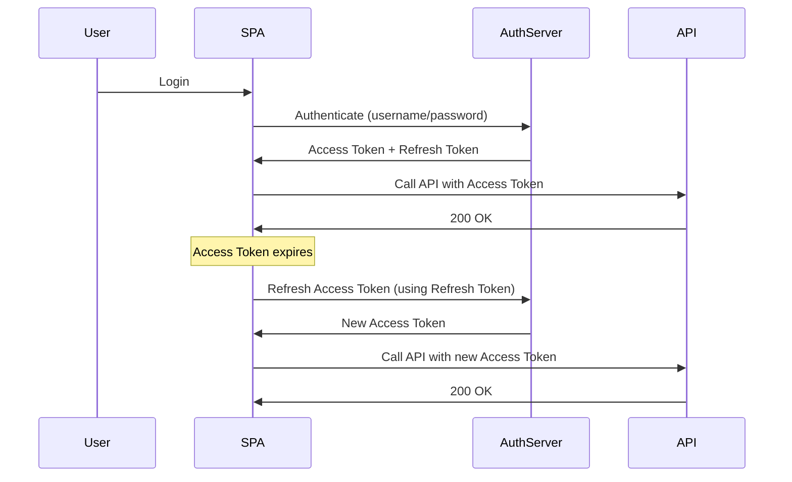
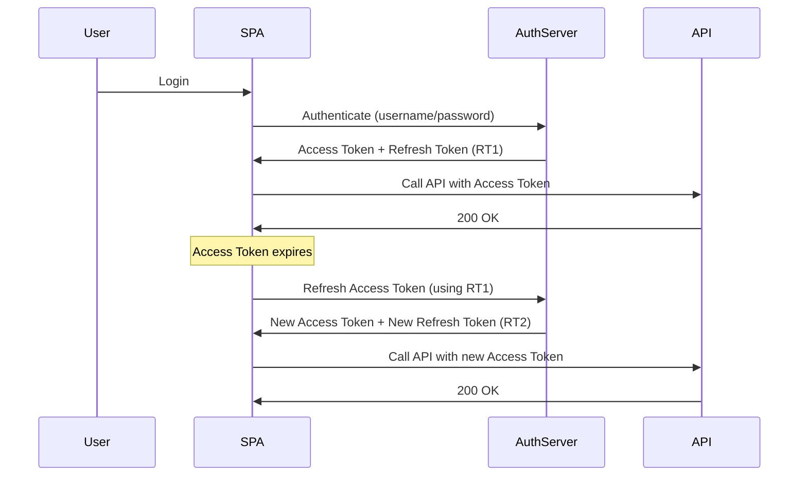

# Quick Recap: Auth Flow in SPAs

In Single Page Applications (SPAs), the authentication flow typically involves the following steps:

- Authenticate the user via an OAuth2 or login API.
- Receive an **Access Token** (short-lived) and **Refresh Token** (long-lived).
- Store:
  - Access Token in memory (e.g., React state, Vuex store).
  - Refresh Token in an HttpOnly cookie (more secure, not accessible via JavaScript).
- Use the Access Token to call your APIs.
- When the Access Token expires, silently refresh it using the Refresh Token.

This flow ensures that the user remains authenticated without needing to log in again, while also maintaining security by keeping the Refresh Token secure and minimizing the exposure of the Access Token.

**The Problem: What If the Refresh Token Gets Stolen?**

Even if the refresh token is stored in a secure cookie, it could still be stolen via:

- Cross-Site Scripting (XSS) attacks
- Browser vulnerabilities
- Misconfigured CORS policies
If an attacker gets your refresh token, they can keep generating new access tokens forever.

To mitigate this risk, you can implement additional security measures such as:

- **Token Rotation**: Issue a new refresh token every time the access token is refreshed. This way, if a refresh token is stolen, it will become invalid after the first use.
- **Shorter Lifetimes**: Reduce the lifespan of refresh tokens to limit the window of opportunity for attackers.
- **Device Binding**: Bind refresh tokens to specific devices or IP addresses, so that they cannot be used from unauthorized locations.
- **Anomaly Detection**: Monitor for unusual refresh token usage patterns and revoke tokens if suspicious activity is detected.

By implementing these strategies, you can significantly reduce the risk of token theft and enhance the security of your authentication flow in SPAs.

## 1. Token Rotation

Token rotation is a technique where:

- Every time a refresh token is used, the server sends **a new refresh token** and invalidates the old one.

This way, if an attacker steals a refresh token, it will become useless after the first use.

In this flow, if an attacker steals RT1, it will be invalid after the first use, and they won't be able to generate new access tokens.

**How to Implement Token Rotation?**

Backend:

- When a refresh token is used, generate a new refresh token and invalidate the old one in the database.
- Return the new refresh token along with the new access token.

Frontend:

- Store the new refresh token received from the server and replace the old one.
- Ensure that the old refresh token is no longer used for future refresh attempts.

By implementing token rotation, you can significantly enhance the security of your authentication flow and reduce the risk of token theft.
