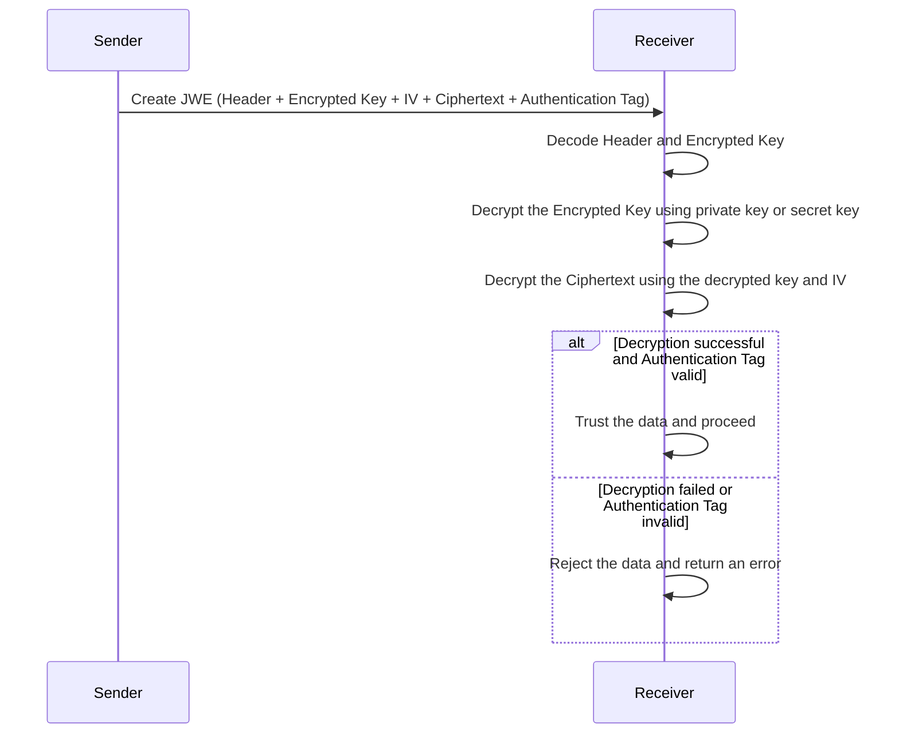

# JSON Web Encrytion (JWE)

**JSON Web Encryption (JWE)** là một chuẩn mở (RFC 7516) định nghĩa cách mã hóa dữ liệu JSON để bảo vệ tính bảo mật của nó. JWE thường được sử dụng để đảm bảo rằng dữ liệu nhạy cảm không bị lộ ra ngoài khi truyền qua mạng.

## Structure of JWE

Một JWE gồm 5 thành phần chính, được mã hóa Base64URL:

- **Header**: Chứa thông tin về thuật toán mã hóa và loại token.
- **Encrypted Key**: Chứa khóa đã được mã hóa bằng thuật toán mã hóa khóa công khai hoặc khóa bí mật.
- **Initialization Vector (IV)**: Một giá trị ngẫu nhiên được sử dụng để đảm bảo rằng cùng một plaintext sẽ tạo ra các ciphertext khác nhau mỗi khi được mã hóa.
- **Ciphertext**: Dữ liệu đã được mã hóa.
- **Authentication Tag**: Một giá trị được sử dụng để xác thực tính toàn vẹn của dữ liệu.

Cấu trúc:

```text
BASE64URL(UTF8(JWE Header)) + '.' +
BASE64URL(JWE Encrypted Key) + '.' +
BASE64URL(JWE Initialization Vector) + '.' +
BASE64URL(JWE Ciphertext) + '.' +
BASE64URL(JWE Authentication Tag)
```

## Flow



## Usage

Để sử dụng JWE, chúng ta cần chỉ định thuật toán mã hóa trong **JWE Header** và sử dụng nó để mã hóa dữ liệu. Ví dụ, nếu chúng ta muốn mã hóa dữ liệu bằng thuật toán **RSA-OAEP**, phần header của JWE sẽ trông như sau:

```json
{
  "alg": "RSA-OAEP",
  "enc": "A256GCM",
  "typ": "JWE"
}
```

Khi tạo JWE, bạn sẽ sử dụng thuật toán đã chỉ định để mã hóa dữ liệu với **khóa công khai (Public Key)** của người nhận. Người nhận sẽ sử dụng khóa riêng tư (Private Key) tương ứng để giải mã JWE và truy cập dữ liệu gốc.
